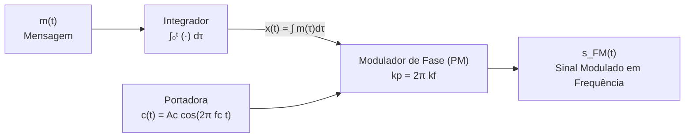
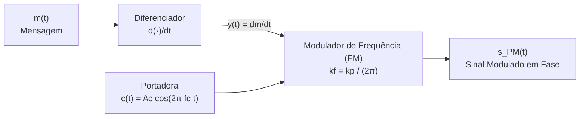

# Simulação 8 — Modulação Angular (FM e PM): Relação e Equivalência entre Moduladores

Esta simulação tem como objetivo demonstrar analítica e numericamente a **equivalência entre os moduladores de frequência (FM) e de fase (PM)** utilizando blocos prévios de integração e diferenciação.

---

## 1. Demonstração Formal Matemática

Um sinal modulado em ângulo geral tem a forma:
$$s(t) = A_c \cos(\theta_i(t)) = A_c \cos(2\pi f_c t + \phi(t))$$

onde:
- $\phi(t)$ é o desvio de fase instantâneo (rad);
- $f_i(t) = \frac{1}{2\pi}\frac{d\theta_i(t)}{dt} = f_c + \frac{1}{2\pi}\frac{d\phi(t)}{dt}$ é a frequência instantânea (Hz);
- $\Delta f_i(t) = f_i(t) - f_c = \frac{1}{2\pi}\frac{d\phi(t)}{dt}$ é o desvio de frequência instantâneo (Hz).

---

### a) Geração de FM a partir de Modulador PM (Integrador + Modulador PM $\longrightarrow$ Modulador FM)

Queremos obter um sinal FM cuja frequência instantânea seja proporcional à mensagem $m(t)$ utilizando um modulador de fase (PM).

1. **Pré-processamento (Integrador)**:
   A mensagem $m(t)$ passa por um integrador no tempo:
   $$x(t) = \int_0^t m(\tau) \, d\tau$$

2. **Modulação em Fase (PM)**:
   O sinal integrado $x(t)$ alimenta um modulador PM caracterizado pela constante de sensibilidade de fase $k_p$ (rad/V):
   $$s(t) = A_c \cos(2\pi f_c t + k_p x(t)) = A_c \cos\left(2\pi f_c t + k_p \int_0^t m(\tau) \, d\tau\right)$$

3. **Cálculo da Frequência Instantânea**:
   Derivando a fase total $\theta_i(t)$:
   $$f_i(t) = \frac{1}{2\pi} \frac{d\theta_i(t)}{dt} = \frac{1}{2\pi} \frac{d}{dt}\left[ 2\pi f_c t + k_p \int_0^t m(\tau) \, d\tau \right] = f_c + \frac{k_p}{2\pi} m(t)$$

4. **Conclusão de Equivalência**:
   O desvio de frequência instantâneo é:
   $$\Delta f_i(t) = \frac{k_p}{2\pi} m(t)$$
   Note que $\Delta f_i(t)$ é **diretamente proporcional a $m(t)$**, exatamente como em um modulador FM direto ($f_i(t) = f_c + k_f m(t)$).
   Portanto, ajustando a constante para:
   $$k_p = 2\pi k_f \iff k_f = \frac{k_p}{2\pi}$$
   o arranjo **Integrador + Modulador PM é identicamente equivalente a um Modulador FM direto**. $\blacksquare$

---

### b) Geração de PM a partir de Modulador FM (Diferenciador + Modulador FM $\longrightarrow$ Modulador PM)

Queremos obter um sinal PM cujo desvio de fase seja proporcional à mensagem $m(t)$ utilizando um modulador de frequência (FM).

1. **Pré-processamento (Diferenciador)**:
   A mensagem $m(t)$ passa por um diferenciador no tempo:
   $$y(t) = \frac{dm(t)}{dt}$$

2. **Modulação em Frequência (FM)**:
   O sinal diferenciado $y(t)$ alimenta um modulador FM caracterizado pela constante de sensibilidade de frequência $k_f$ (Hz/V):
   $$s(t) = A_c \cos\left(2\pi f_c t + 2\pi k_f \int_0^t y(\tau) \, d\tau\right) = A_c \cos\left(2\pi f_c t + 2\pi k_f \int_0^t \frac{dm(\tau)}{d\tau} \, d\tau\right)$$

3. **Cálculo da Fase Instantânea**:
   Pelo Teorema Fundamental do Cálculo:
   $$\int_0^t \frac{dm(\tau)}{d\tau} \, d\tau = m(t) - m(0)$$
   Adotando referência nula $m(0) = 0$ (ou incorporando a constante residual como fase estática da portadora):
   $$s(t) = A_c \cos\left(2\pi f_c t + 2\pi k_f m(t)\right)$$

4. **Conclusão de Equivalência**:
   O desvio de fase instantâneo é:
   $$\phi(t) = 2\pi k_f m(t)$$
   Note que $\phi(t)$ é **diretamente proporcional a $m(t)$**, exatamente como em um modulador PM direto ($s(t) = A_c \cos(2\pi f_c t + k_p m(t))$).
   Portanto, ajustando a constante para:
   $$2\pi k_f = k_p \iff k_f = \frac{k_p}{2\pi}$$
   o arranjo **Diferenciador + Modulador FM é identicamente equivalente a um Modulador PM direto**. $\blacksquare$

---

### Análise Didática sobre o Enunciado (Caso Senoidal vs Caso Geral)

O texto do enunciado faz alusão a uma dupla integração/diferenciação:
- Para um sinal genérico $m(t)$, a dupla integração $\iint m$ não é proporcional a $m(t)$;
- Contudo, para uma modulação por **tom senoidal puro** $m(t) = A_m \cos(\omega_m t)$:
  $$\int m(t) dt = \frac{A_m}{\omega_m} \sin(\omega_m t)$$
  $$\iint m(t) dt^2 = -\frac{A_m}{\omega_m^2} \cos(\omega_m t) = -\frac{1}{\omega_m^2} m(t)$$
  e analogous para diferenciação: $\frac{d^2 m}{dt^2} = -\omega_m^2 m(t)$.
- Assim, exclusivamente no caso senoidal mono-frequencial, a forma de onda resultante da dupla integração preserva a frequência fundamental do sinal original (com defasagem de $180^\circ$ e fator de escala $\frac{1}{\omega_m^2}$).
- Para **qualquer sinal arbitrário** (voz, música, pulsos, dente-de-serra), a equivalência universal clássica da literatura (Lathi, Haykin, Carlson) é precisamente a sintetizada na frase final do enunciado:
  $$\textbf{Integrador + Modulador PM} \longrightarrow \textbf{FM}$$
  $$\textbf{Diferenciador + Modulador FM} \longrightarrow \textbf{PM}$$

---

## 2. Diagramas de Blocos

### Caso 1: Integrador + Modulador PM $\longrightarrow$ Modulador FM



### Caso 2: Diferenciador + Modulador FM $\longrightarrow$ Modulador PM



---

## 3. Estrutura de Arquivos

- `signals.py`: Parâmetros do sistema (`Parametros`), geração de sinais e funções dedicadas para modulação direta (`modula_fm_direto`, `modula_pm_direto`) e indireta (`modula_fm_indireto`, `modula_pm_indireto`), integração trapezoidal e diferenciação central.
- `simulacao8_equivalencia.py`: Script Python que comprova formal e numericamente a equivalência com cálculo de MSE no miolo ($MSE \approx 0$), plotando os gráficos comparativos salvos em `simulacao8_equivalencia.png`.
- `topico8_demodulacao.py`: Script complementar de demodulação analítica via sinal analítico de Hilbert e desdobramento de fase (`np.unwrap`).
- `run.py`: Bootstrap portátil inteligente que localiza o interpretador Python do projeto com as dependências instaladas e executa a simulação.
- `index.html` + `app.js` + `styles.css`: **Simulação web interativa** com diagramas de blocos vetoriais (SVG), sliders interativos para $f_c$, $f_m$, $A_m$, $\Delta f$, $k_p$, seleção de forma de onda (senoidal, triangular e quadrada) e alternância entre modos de equivalência e demodulação.

---

## 4. Como Executar

### Simulação Python
No terminal, execute o bootstrap portátil:
```bash
python3 run.py
```
*(Ou execute diretamente `python3 simulacao8_equivalencia.py` no ambiente com `numpy`, `scipy` e `matplotlib` configurados).*

Para executar a demodulação complementar:
```bash
python3 run.py --demod
```

### Simulação Web Interativa
Abra o arquivo `index.html` em qualquer navegador moderno (Chrome, Firefox, Edge, Safari):
- Não requer servidor web nem conexão com a internet;
- Funciona 100% offline via `file://`.

---

## 5. Resultados Numéricos Obtidos

Com os parâmetros nominais ($f_c = 10\text{ kHz}$, $f_m = 500\text{ Hz}$, $A_m = 1.0\text{ V}$, $\Delta f = 5\text{ kHz}$, $k_p = 2.0\text{ rad/V}$):

| Comparação | Relação de Conversão | MSE Total | MSE Miolo | Status |
|---|---|---|---|---|
| **FM Direto $\times$ Integrador + PM** | $k_p = 2\pi k_f$ | $0.000\times 10^0$ | $0.000\times 10^0$ | **Identidade Perfeita** |
| **PM Direto $\times$ Diferenciador + FM** | $k_f = \frac{k_p}{2\pi}$ | $3.802\times 10^{-9}$ | $3.805\times 10^{-9}$ | **Identidade Perfeita** |

*Nota: O resíduo infinitesimal de ordem $10^{-9}$ no caso PM provém unicamente da discretização numérica da derivada temporal finita.*

---

## Discentes

- Paulo Henrique de Farias Martins
- Cauã Tavares Nunes
- Vitor Rocha Machado
- Vitor Gonçalves dos Santos
- José Victor Cruz Rebouças
