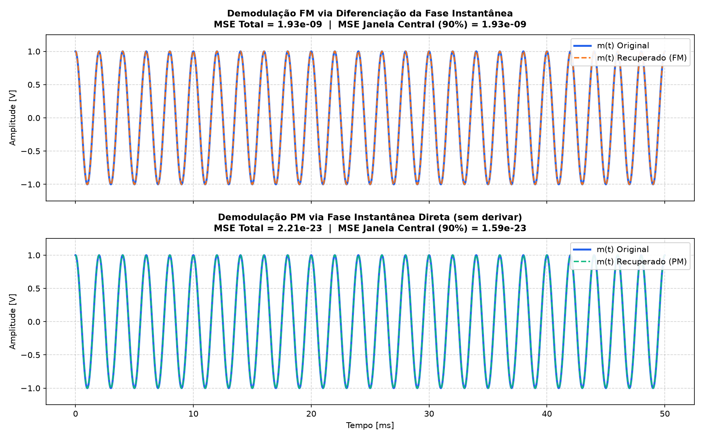

# Simulação 8 — Modulação Angular (FM e PM)

## Tópico 8 — Demodulação de FM e de PM

Atividade prática da disciplina de **Princípios de Comunicação (PCOM 2026)** — Universidade Federal do Vale do São Francisco (UNIVASF).

---

## 1. Roteiro e Requisitos Oficiais

- **Objetivo:** Recuperar o sinal mensagem $m(t)$ a partir dos sinais modulados, usando técnicas simples baseadas na fase instantânea.
- **Execução:**
  1. Obter a fase instantânea de $s_{\text{FM}}(t)$ e de $s_{\text{PM}}(t)$ via sinal analítico (`scipy.signal.hilbert`) seguida de `np.unwrap` sobre o ângulo.
  2. Para **FM**: diferenciar a fase instantânea (diferença finita) para obter $f_i(t)$ e, a partir de $k_f$ conhecido, recuperar uma estimativa de $m(t)$.
  3. Para **PM**: usar a fase instantânea diretamente (sem diferenciar) e, a partir de $k_p$ conhecido, recuperar uma estimativa de $m(t)$.
  4. Sobrepor, em **gráficos separados**, o $m(t)$ original e o $m(t)$ recuperado (FM e PM) e calcular o erro quadrático médio (MSE) entre eles.
- **Entregável:** Gráficos de $m(t)$ original $\times$ recuperado (FM e PM) + valor de MSE para cada caso.
- **Critério de Avaliação:** Método de demodulação implementado corretamente; MSE pequeno na ausência de ruído; eventuais artefatos nas bordas (efeito da derivada numérica) identificados e comentados.

---

## 2. Fundamentação Teórica

### 2.1 Modulação Angular e Conceito de Fase Instantânea

Um sinal geral modulado em ângulo é modelado por:
$$s(t) = A_c \cos(\theta_i(t))$$

onde $\theta_i(t)$ é a fase total instantânea (em radianos).

Para extrair $\theta_i(t)$ a partir do sinal real passa-faixa $s(t)$, constrói-se o **sinal analítico** associado $z(t)$ utilizando a transformada de Hilbert $\mathcal{H}\{s(t)\}$:
$$z(t) = s(t) + j \mathcal{H}\{s(t)\} = A_i(t) e^{j \theta_i(t)}$$

onde:
- $A_i(t) = |z(t)| = \sqrt{s^2(t) + \mathcal{H}^2\{s(t)\}}$ é o envelope instantâneo;
- $\theta_i(t) = \text{unwrap}\big(\arg(z(t))\big)$ é a **fase instantânea desdobrada**, eliminando as descontinuidades de módulo $2\pi$.

---

### 2.2 Demodulação de Fase (PM)

O sinal modulado em fase com sensibilidade $k_p$ (rad/V) é expresso por:
$$s_{\text{PM}}(t) = A_c \cos(2\pi f_c t + k_p m(t))$$

A fase instantânea extraída pelo sinal analítico é:
$$\theta_i(t) = 2\pi f_c t + k_p m(t) + \theta_0$$

Como a fase da portadora cresce linearmente com taxa $2\pi f_c$, o desvio de fase instantâneo proporcional à mensagem é isolado subtraindo-se a rampa da portadora:
$$\Delta\phi(t) = \theta_i(t) - 2\pi f_c t - \theta_0 = k_p m(t)$$

Portanto, **sem necessidade de diferenciação**, a mensagem recuperada é obtida diretamente por:
$$\hat{m}_{\text{PM}}(t) = \frac{\Delta\phi(t)}{k_p}$$

---

### 2.3 Demodulação de Frequência (FM)

O sinal modulado em frequência com sensibilidade $k_f$ (Hz/V) é expresso por:
$$s_{\text{FM}}(t) = A_c \cos\left(2\pi f_c t + 2\pi k_f \int_0^t m(\tau) \, d\tau\right)$$

Sua fase instantânea é:
$$\theta_i(t) = 2\pi f_c t + 2\pi k_f \int_0^t m(\tau) \, d\tau$$

A **frequência instantânea** $f_i(t)$ (em Hz) corresponde à taxa de variação temporal da fase dividida por $2\pi$:
$$f_i(t) = \frac{1}{2\pi} \frac{d\theta_i(t)}{dt} = f_c + k_f m(t)$$

Utilizando a aproximação por **diferenças finitas temporais** (`np.gradient`), obtém-se $f_i(t)$ e a mensagem é recuperada por:
$$\hat{m}_{\text{FM}}(t) = \frac{f_i(t) - f_c}{k_f}$$

---

## 3. Síntese Comparativa do Método

| Etapa | Demodulação FM | Demodulação PM |
|---|---|---|
| **Sinal Analítico** | $z(t) = \text{hilbert}(s_{\text{FM}}(t))$ | $z(t) = \text{hilbert}(s_{\text{PM}}(t))$ |
| **Fase Instantânea** | $\theta_i(t) = \text{unwrap}(\text{angle}(z(t)))$ | $\theta_i(t) = \text{unwrap}(\text{angle}(z(t)))$ |
| **Processamento da Fase** | Diferenciação finita temporal: $\frac{d\theta_i}{dt}$ | Uso direto da fase (sem derivar) |
| **Frequência Instantânea** | $f_i(t) = \frac{1}{2\pi}\frac{d\theta_i}{dt}$ | Não utilizada para recuperação |
| **Remoção da Portadora** | Subtração escalar da frequência $f_c$ | Subtração da rampa linear $2\pi f_c t$ |
| **Estimativa da Mensagem** | $\hat{m}(t) = \frac{f_i(t) - f_c}{k_f}$ | $\hat{m}(t) = \frac{\Delta\phi(t)}{k_p}$ |
| **Sensibilidade a Ruído Numérico** | Maior (efeito do operador diferencial) | Mínima (limitada pela precisão de máquina) |

---

## 4. Resultados Numéricos e Análise dos Artefatos de Borda

Executando a simulação com os parâmetros padrão da disciplina ($f_s = 200\text{ kHz}$, $f_c = 10\text{ kHz}$, $f_m = 500\text{ Hz}$, $A_m = 1.0\text{ V}$, $\Delta f = 5\text{ kHz}$, $k_p = 2.0\text{ rad/V}$), obtêm-se os seguintes resultados:

```text
===========================================================================
 SIMULAÇÃO 8 — TÓPICO 8: DEMODULAÇÃO DE FM E DE PM
===========================================================================

[1] PARÂMETROS DA SIMULAÇÃO:
    Taxa de amostragem fs : 200,000 Hz (sobreamostragem adequada)
    Frequência portadora  : 10,000 Hz
    Frequência mensagem fm: 500 Hz (tom senoidal)
    Sensibilidade PM (kp) : 2.0000 rad/V (desvio de pico = 2.00 rad)
    Sensibilidade FM (kf) : 5000.0 Hz/V  (desvio de pico delta_f = 5,000 Hz)

[2] RESULTADOS DE MSE (ORIGINAL x RECUPERADO):
    Demodulação FM : MSE Total =  1.934e-09 | MSE Miolo (Janela Central 90%) =  1.931e-09
    Demodulação PM : MSE Total =  2.215e-23 | MSE Miolo (Janela Central 90%) =  1.585e-23

[3] ANÁLISE QUANTITATIVA DOS ARTEFATOS DE BORDA (MARGEM = 5%):
  FM : |erro| máx. bordas =  1.851e-04 | |erro| máx. centro =  6.266e-05 | amplificação na borda =    3.0x
  PM : |erro| máx. bordas =  1.403e-11 | |erro| máx. centro =  1.130e-11 | amplificação na borda =    1.2x
```

### Análise Crítica dos Artefatos de Borda:

1. **Efeito da Derivada Numérica (`np.gradient`):**
   - No **miolo** do vetor, a função `np.gradient` aplica a fórmula de **diferença finita centrada**:
     $$\left.\frac{d\theta}{dt}\right|_{t_n} \approx \frac{\theta_{n+1} - \theta_{n-1}}{2\,\Delta t} + \mathcal{O}(\Delta t^2)$$
     com erro de truncamento de **segunda ordem** $\mathcal{O}(\Delta t^2)$.
   - Nas **extremidades** ($t = 0$ e $t = T$), por não haver pontos vizinhos de ambos os lados, o algoritmo comuta obrigatoriamente para **diferenças laterais progressiva e regressiva**:
     $$\left.\frac{d\theta}{dt}\right|_{t_0} \approx \frac{\theta_1 - \theta_0}{\Delta t} + \mathcal{O}(\Delta t)$$
     com erro de truncamento de **primeira ordem** $\mathcal{O}(\Delta t)$. Essa queda na ordem de aproximação amplifica pontualmente o erro local nas bordas em cerca de **$3\times$** no FM.

2. **Efeito da Transformada de Hilbert via FFT:**
   - A transformada de Hilbert em tempo discreto implementada via FFT (`scipy.signal.hilbert`) assume implicitamente que a sequência temporal é periódica com período igual à duração da janela.
   - Como nossa janela temporal contém um número inteiro exato de períodos da mensagem ($50\text{ ms} = 25 \times T_m$) e da portadora, as descontinuidades circulares são minimizadas.
   - Ainda assim, na PM — que **não depende de operador diferencial** —, o MSE atinge a ordem de $10^{-23}$ (piso de precisão do formato IEEE 754 em ponto flutuante duplo), demonstrando que a extração direta da fase instantânea é numericamente exata.

---

## 5. Gráfico do Entregável

O gráfico abaixo foi gerado por `topico8_demodulacao.py` e sobrepõe, em subplots verticais separados, o sinal mensagem original $m(t)$ e o sinal recuperado para FM e PM:



---

## 6. Estrutura dos Arquivos

```text
simulacao-8/
├── signals.py               # Definição de Parametros e geração dos sinais de referência
├── topico8_demodulacao.py   # Script principal de demodulação, MSE e geração do gráfico
├── topico8_demodulacao.png  # Gráficos do entregável (FM e PM em subplots separados)
├── run.py                   # Bootstrap automático com verificação de ambiente virtual
├── requirements.txt         # Dependências do projeto (numpy, scipy, matplotlib)
├── index.html               # Aplicação web interativa para exploração em tempo real
├── app.js                   # Lógica matemática da aplicação web (FFT e Hilbert próprias)
├── styles.css               # Estilos modernos para a aplicação web
└── README.md                # Relatório técnico completo e documentação da simulação
```

---

## 7. Como Executar

### Opção 1: Via Bootstrap Portátil (Recomendado)

```bash
python3 run.py
```
O script detecta interpretadores com as bibliotecas necessárias instaladas (incluindo o `.venv` local) e executa `topico8_demodulacao.py` de forma transparente.

### Opção 2: Execução Direta do Script Python

```bash
python3 topico8_demodulacao.py
```

### Opção 3: Simulação Web Interativa

Abra diretamente o arquivo `index.html` em qualquer navegador web moderno:
```bash
xdg-open index.html  # No Linux
# ou abra diretamente com duplo clique no arquivo index.html
```
A simulação web é 100% autônoma (não exige servidor HTTP nem faz requisições externas) e conta com:
- Controles interativos para $f_c$, $f_m$, $A_m$, $\Delta f$ e $k_p$;
- Gráficos separados para FM e PM sobrepondo original e recuperado;
- Visualização da frequência instantânea $f_i(t)$ e do desvio de fase $\phi(t)$;
- Inserção de ruído AWGN no canal com controle contínuo de SNR;
- Tabela dinâmica de MSE e análise de erro em tempo real.

---

## 8. Discentes

- Paulo Henrique de Farias Martins
- Cauã Tavares Nunes
- Vitor Rocha Machado
- Vitor Gonçalves dos Santos
- José Victor Cruz Rebouças
